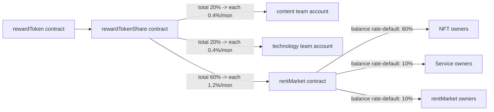
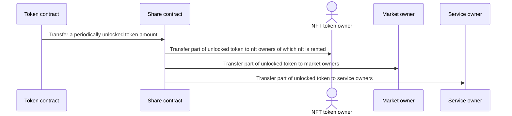
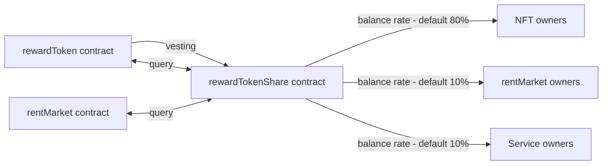

# 🇹🇰 Ecosystem

## Total Reward Policy

### Policy Diagram

### Supply Policy Description

* Total token supply
  * 1 billion
* Total Vesting proportion
  * <mark style="color:red;">**Content team**</mark> (20%)
  * <mark style="color:yellow;">**Technology team**</mark> (20%)
  * <mark style="color:green;">**Contributors**</mark> (60%)
* Vesting Frequency
  * 50 release intervals occurring every 5 weeks.
  * Total vesting duration is 250 weeks, equivalent to roughly 5 years.

For each release interval, a specific percentage of tokens is allocated: <mark style="background-color:yellow;">**0.4% for both the content and technology teams (2 million tokens to each)**</mark> and <mark style="background-color:yellow;">**1.2% for the community (12 million tokens)**</mark>.

These tokens are gradually transferred to the respective team accounts or the rent market contract, ensuring a steady and controlled distribution of tokens over the 5-year period.

The aim of this measured approach is to support the long-term commitment and engagement of the content and technology teams while fostering a strong and sustainable community ecosystem.

### Policy Summary

* Vesting (content team - 20%, technology team - 20%, contributors-60% in 250 weeks, about 5 years)
  * Frequency
    * Total release count : 50 (about 1 release / 5 weeks)
  * <mark style="color:red;">**Content Team**</mark> : 20% in about 5 years → 50 frequency for 250 weeks
    * 4 million - 0.4% / 5 weeks rate (minimum frequency is 5 weeks)
      * Transfer vesting token to the content team account
  * <mark style="color:yellow;">**Technology Team**</mark> : 20% in about 5 years → 50 frequency for 250 weeks
    * 4 million - 0.4% / 5 weeks rate (minimum frequency is 5 weeks)
      * Transfer vesting token to the technology team account
  * <mark style="color:green;">**Community**</mark> : 60% in about 5 years → 50 frequency for 250 weeks
    * 12 million - 1.2% / 5 weeks rate (minimum frequency is 5 weeks)
      * Transfer vesting token to the rent market contract

## <mark style="color:green;">Community</mark> Reward Policy

### Process Diagram

### Mechanisms Process

Our token incentive program is tailored for contributors, including token holders, <mark style="color:blue;">**NFT owners**</mark>, <mark style="color:purple;">**rentMarket owners**</mark>, and <mark style="color:orange;">**Service owners**</mark>, distributing <mark style="background-color:yellow;">**1.2% of the total token supply (12 million tokens), every 5 weeks**</mark> based on their respective balance rates.

#### Community

* <mark style="color:blue;">**NFT owners**</mark>
  * Reducing token liquidity
    * Holdings tokens in the market balance wallet
    * Earning market balance through NFT rentals.
* <mark style="color:purple;">**rentMarket owners**</mark>
  * Support the project
    * Holding tokens in the market balance wallet
    * Receiving market balance through rent market fees.
* <mark style="color:orange;">**Service owners**</mark>
  * Contribution
    * Maintaining token liquidity in the market balance wallet
    * Earning market balance from rent market fees.

The contribution value is based on the holding token amount at the market balance.

The reward process is managed through a vesting program facilitated by the rewardToken and rewardTokenShare contracts.

### Process Summary

* At each vesting, total distribution to these 3 contributors is 12 million (1.2% / 5 weeks) token.
* <mark style="color:blue;">**NFT owners**</mark>
  * 9.6 million tokens (80%)
* <mark style="color:purple;">**rentMarket owners**</mark>
  * 1.2 million tokens (10%)
* <mark style="color:orange;">**Service owners**</mark>
  * 1.2 million tokens (10%)
