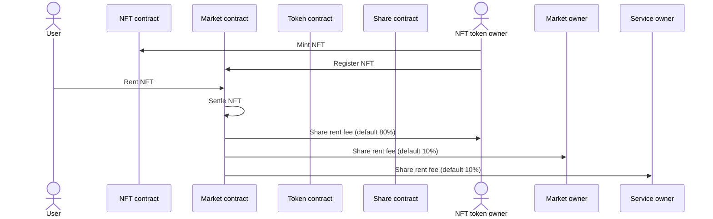

# 🇩🇰 Rent Market

1. **NFT Minting and Registration**
   * The NFT token owner (NO) mints an NFT and registers it within the NFT contract (N).
2. **Renting Process**
   * The user (U) initiates the process by renting the NFT from the market contract (M), leading to the settlement of the NFT within the market contract.
3. **Fee Distribution**
   * Following the rental, the market contract (M) distributes the rent fee to the NFT token owner (NO), the market owner (MO), and the service owner (SO) as part of the fee-sharing process.

