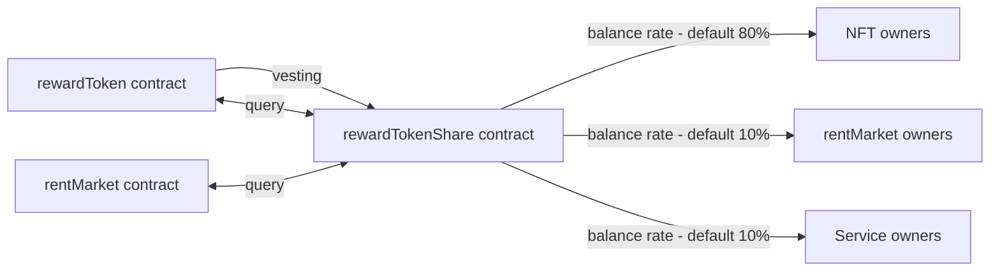
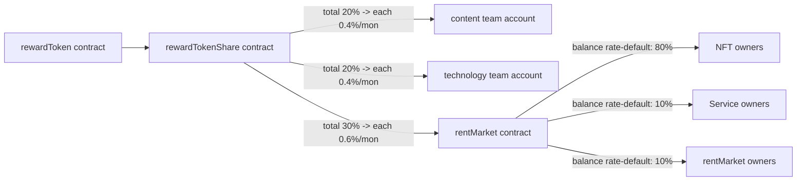

# 🇹🇰 Tokenomics

## Objectives

### **Problem**

Content creators often face challenges related to content ownership, including copyright infringement and lack of fair compensation for their work.

### **Solution Without Product**

Without our platform, content creators might rely on traditional copyright systems, which can be slow, expensive, and prone to disputes.

### **How Your Product Helps**

Our blockchain-based platform enables content creators to securely register their work, ensuring immutable proof of ownership and facilitating transparent royalty distribution.

### **User Benefit from Network Effects**

Through the platform, content creators can connect with a larger audience, leading to increased exposure and potential collaborations with other creators and industry professionals.

### **Token's Contribution**

The platform's token incentivizes content creators by rewarding them for producing high-quality content, engaging with their audience, and participating in platform governance, thereby strengthening the network's content diversity and user engagement.

### **User Incentive to Hold the Token**

Holding the platform's token grants content creators voting rights on platform decisions, and access to exclusive features, fostering a sense of ownership and active participation within the community.

## Value Accrual

**Value Created**

Our services offer content consumers a diverse range of high-quality, authenticated content, fostering a trustworthy and engaging digital content experience.

### **Value Capture**

The platform captures value from content consumers through subscription fees, pay-per-view models, and targeted advertising, ensuring a sustainable revenue stream for the platform's operations.

### **Frictions or Costs**

Content consumers might experience friction related to payment processing, content authenticity concerns, and intrusive advertising, which can diminish the overall user experience.

### **Accrual to the Token**

A portion of the platform's revenue is allocated to a token-based reward pool, enabling token holders to participate in governance decisions, access exclusive content, and receive incentives for active engagement, thereby fostering a stronger and more committed user community.

## Incentive Mechanisms

### Mechanisms Process

Our token incentive program is tailored for contributors, including token holders, NFT owners, market owners, and service owners, distributing 0.6% of the total token supply every 5 weeks based on their respective balance rates. NFT owners contribute to the project by reducing token liquidity through holdings in the market balance wallet, earning market balance through NFT rentals. Market owners also support the project by holding tokens in the market balance wallet, receiving market balance through rent market fees. Similarly, service owners contribute by maintaining token liquidity in the market balance wallet, earning market balance from rent market fees. The contribution value is assessed based on the holding token amount at the market balance, while the reward process is managed through a vesting program facilitated by the rewardToken and rewardTokenShare contracts, ultimately benefiting the project's rentMarket contract and its market balance wallet.

### Process Summary

* Distribute 6 million (0.6% / 5 weeks) token to these 3 contributors as their each balance rate.
* NFT owners
  * They contribute the project because they lower token liquidity by holding tokens in market balance wallet.
    * They earn market balance by letting their NFT rented by renter.
  * CV (Contribution Value) : The holding token amount at market balance.
* Market owners
  * They contribute the project because they lower token liquidity by holding tokens in market balance wallet.
    * They earn market balance by getting rent market fee.
  * CV (Contribution Value) : The holding token amount at market balance.
* Service owners
  * They contribute the project because they lower token liquidity by holding tokens in market balance wallet.
    * They earn market balance by getting rent market fee.
  * CV (Contribution Value) : The holding token amount at market balance.

### Process Diagram

## Supply Policy

### Supply Policy Description

The total token supply is 1 billion, with a vesting scheme extending over 250 weeks, equivalent to roughly 5 years. The vesting process applies to the content team (20%), technology team (20%), and contributors (30%), each with 50 release intervals occurring every 5 weeks. For each release interval, a specific percentage of tokens is allocated: 0.4% for both the content and technology teams (4 million tokens each) and 0.6% for the community (6 million tokens). These tokens are gradually transferred to the respective team accounts or the rent market contract, ensuring a steady and controlled distribution of tokens over the 5-year period. The aim of this measured approach is to support the long-term commitment and engagement of the content and technology teams while fostering a strong and sustainable community ecosystem.

### Policy Summary

* Vesting (content team - 20%, technology team - 20%, contributors-30% in 250 weeks, about 5 years)
  * Frequency
    * Total release count : 50 (about 1 release / 5 weeks)
  * Content Team : 20% in about 5 years → 50 frequency for 250 weeks
    * 4 million - 0.4% / 5 weeks rate (minimum frequency is 5 weeks)
      * Transfer vesting token to the content team account
  * Technology Team : 20% in about 5 years → 50 frequency for 250 weeks
    * 4 million - 0.4% / 5 weeks rate (minimum frequency is 5 weeks)
      * Transfer vesting token to the technology team account
  * Community : 30% in about 5 years → 50 frequency for 250 weeks
    * 6 million - 0.6% / 5 weeks rate (minimum frequency is 5 weeks)
      * Transfer vesting token to the rent market contract

### Policy Diagram

