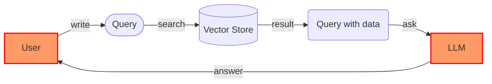

# 🎑 Overview

<figure><figcaption></figcaption></figure>

## AI service

Our company provides a data-driven chatbot SaaS. Your private documents or other public data can be used to ask and receive answers. You can use a chatbot with your own document in confidential mode, or provide a service with your own chatbot API. If you want to use on-premise, we can support with private vector store, embedding, and LLM technology.


<mark style="color:orange;">**Data-driven chatbot**</mark> uses <mark style="color:green;">**RAG**</mark>(Retrieval-Augmented Generation) and <mark style="color:green;">**TAG**</mark>(Tool-Augmented Generation) technology.


The data-driven chatbot is similar to QA chatbots that acquire data from documents or databases. User can write a blog posts with product information or make a customer response email with customer history data. If you can manage prompts, you can make a chatbot character like a foreign language teacher or astrologer.

## Web3 service

You can make a service with your own chatbot API. We will provide a few services with web3 and generative AI technology. And these are all open source. Make your idea a reality with realbits.
