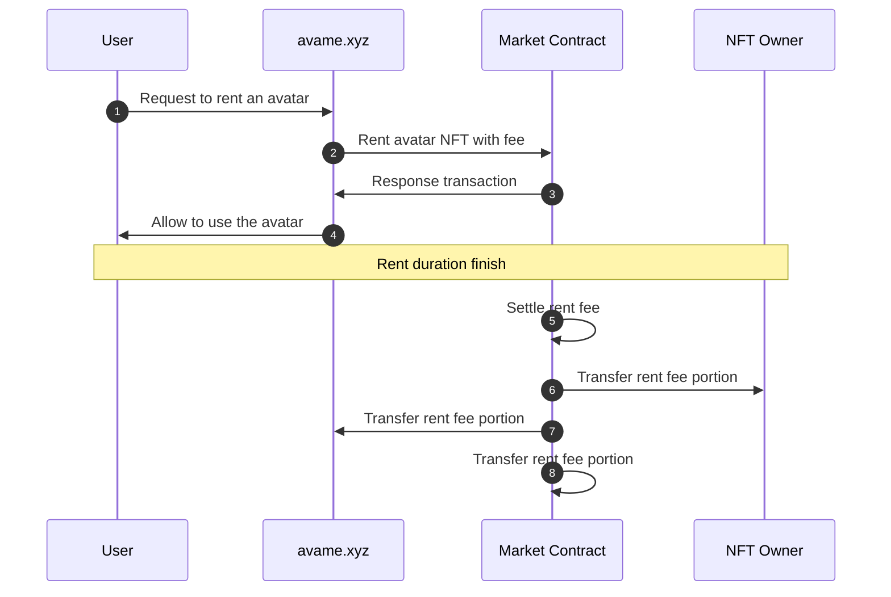

# 🏈 AVAME

## **Description**

Users can select avatar character and have a dialogue.

<figure><figcaption>
Avatar screen
</figcaption></figure>

## **Sequence Diagram**

## **Site**

* [https://test.avame.xyz](https://test.avame.xyz/)

## **GitHub**

* [https://github.com/realbits-lab/avame](https://github.com/realbits-lab/avame)

## NFT Metadata

<pre class="language-json"><code class="lang-json">{ 
    "name": "NFT name #1",
    "symbol": "NST",
    "description": "For people who like NFT.",
    "image": "https://test-nft.s3.ap-northeast-2.amazonaws.com/image/1.png",
    "realbits":
    {
        "glb_url": "https://test-nft.s3.ap-northeast-2.amazonaws.com/glb/1.glb",
        "vrm_url": "https://test-nft.s3.ap-northeast-2.amazonaws.com/vrm/1.vrm"
    },
    "attributes": [
        { "trait_type": "Body", "value": "1" },
<strong>        { "trait_type": "Body_Top", "value": "1" },
</strong>        { "trait_type": "Body_Bottom", "value": "1"}
    ]
}
</code></pre>

#### name

* NFT token name

#### symbol

* NFT symbol

#### description

* NFT token description

#### image

* NFT token snapshot image for market display

#### realbits - glb\_url

* Attribute for avatar chatting or metaverse service
* This glb file will be used for avatar display

#### realbits - vrm\_url

* Attribute for avatar chatting or metaverse service
* This vrm file will be used for showing avatar

#### attributes - trait\_type

* Attribute for general purpose

#### attributes - value

* Attribute for general purpose
