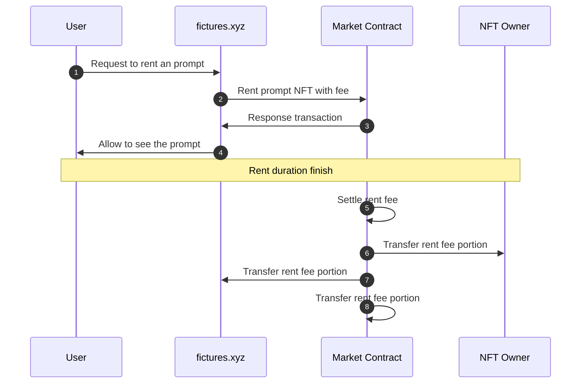

# 🖼 Fictures

## Description

User can draw image using prompt with generative AI technology. User can mint NFT with the image.

User can generate and draw images with prompt text. Then, if desired, the image can be published as NFT with encrypted prompt data.

Whether minting is done or not, if user select to post image, image will be posted on service site. A minting image would not display the prompt to the user.

When the user wants to see the prompt, user would have to pay a token and see the prompt for a limited time (perhaps one day). When prompt duration ends, prompt fee will be shared with NFT owner, service owner, and market owner by smart contract.

<figure><figcaption>
Image NFT
</figcaption></figure>

## Service Sequence Diagram

## **Site**

* [https://test.fictures.xyz](https://test.fictures.xyz/)

## **GitHub**

* [https://github.com/realbits-lab/prompt-nft](https://github.com/realbits-lab/prompt-nft)
