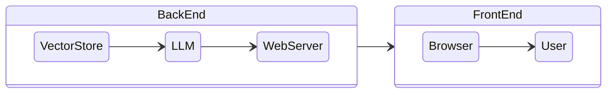
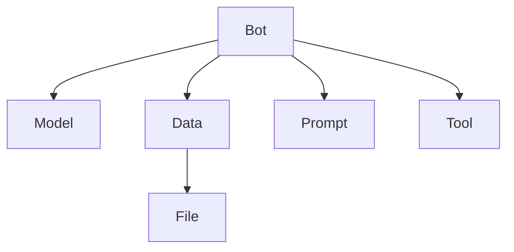

# 🦷 Thothy

## Architecture

There are two components to Thothy SaaS: the front-end web application and the back-end server. In addition to supporting desktop and mobile web, the web front-end supports Chrome, Safari, and Edge browsers. The back-end server consists of a web server, a vector store, and a LLM framework. There are two types of LLM: OpenAI API and private LLM.

## Components

The Thothy is composed of five components.

### Bot

**Bot has model, data, prompt, and tool inside as a link.** User can select them from a list view. For example, the user can use a private LLM model, private data, a specific prompt, and an image generation tool. Model is mandatory but data, prompt, and tool are optional. As for chatbots, they can be foreign language teachers or marketing copywriters.

### Model

**The model is LLM (Large Language Model).** The public LLM is OpenAI's GPT-3.5 or GPT-4. But there are good LLMs available for open commercial license. Realbits is trying to use them as a performance-fine-tuned model. And for the retrieval process, Realbits' fine-tuned embedding model is used. User can choose between a GPT and open LLM.

### Data

**Data is retrieved from a vector database.** Once user uploads data files to server, server extracts embedding vectors from them, and store in vector database. In case of a query from the user, the server searches for similarity in the vector database. Various file types can be supported.

### Prompt

There are two types of prompts for chatbots. One is system type and the other is user type. As a general rule, the **system prompt** can manage the entire chat. User can modify chatbot's profile and response behavior using this system prompt. **User prompt** is a chat prompt. User can query using the prompt provided by this user.

### Tool

**Tool is used to perform any task with other systems.** A chatbot can search any web page using the web search API, for example, if the user queries for searching a web page using that function. Or with image generation API, user can ask for drawing an image to LLM.

## Features

### Flexible bot

User can change bot's attributes, such as data, prompt, tool, model. User can select each component in a list view and use that DIY bot in a chatbot. Users can, for example, use two bots if they have two types of document data. Each bot has a link to a different type of document information. In addition, users can control the bot's response behavior by handling prompts. When a user asks the chatbot to act as a teacher or counselor, the chatbot will act accordingly.

### Good matching

Thothy has two methods for embedding. One process uses chunking for dividing document data. Another method is to transfer documents to QA-type text through document transfer. With the second process, similarity searching is more accurate, because it is based on QA type data. Even though this process uses more resources to generate data, it is worth the effort for a high quality matching result.

### Fast response

Thothy uses a proprietary embedding model. It is also possible to use private LLM if the user selects private LLM. Models of this type are well-suited for performance. In this way, the response time is dramatically reduced as compared to general LLM. SOTA technology is incorporated into Thothy's continuous improvement process.

### Limited cost

Private LLM usage costs are limited to SaaS subscription price. While most LLM pricing models are based on usage costs, Thothy offers a different pricing model. The limited cost model eliminates the need for users to monitor the usage of services.

### Service API

A user can extend a chatbot to the outside world by using the API of the service. If user sets service API for chatbot, user can access that API with an authentication key. A user can create AI avatar services using this function or any other interesting and funny service.

## Pricing

Pricing model has two types. One is for enterprise and subscription fee is $1,000 per month. In case of on-premise, contact us by <mark style="color:blue;">**ai.thothy@gmail.com**</mark>.

| Feature     | Enterprise            | On-premise                  |
| ----------- | --------------------- | --------------------------- |
| Price       | $1,000 / month        | Contact (Subscription base) |
| Data        | 500M                  | Unlimited                   |
| Prompt      | Unlimited             | Unlimited                   |
| Tool        | Available             | Available                   |
| API         | $1,000 / 10K sessions | $1,000 / 10K sessions       |
| private LLM | Available             | Available                   |
