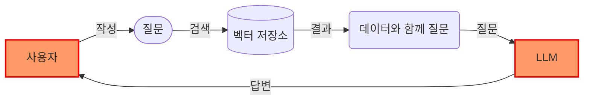

# 🎑 개요

<figure><figcaption></figcaption></figure>

## AI 서비스

저희 회사는 데이터 기반 챗봇 SaaS를 제공합니다. 개인 문서나 다른 공개 데이터를 사용하여 질문하고 답변을 받을 수 있습니다. 기밀 모드에서 자체 문서와 함께 챗봇을 사용하거나 자체 챗봇 API로 서비스를 제공할 수 있습니다. 온프레미스에서 사용하려면 개인 벡터 저장소, 임베딩 및 LLM 기술을 지원해 드릴 수 있습니다.


<mark style="color:orange;">**데이터 기반 챗봇**</mark>은 <mark style="color:green;">**RAG**</mark>(검색 기반 생성) 및 <mark style="color:green;">**TAG**</mark>(도구 기반 생성) 기술을 사용합니다.


데이터 기반 챗봇은 문서나 데이터베이스에서 데이터를 가져오는 QA 챗봇과 유사합니다. 사용자는 제품 정보가 포함된 블로그 글을 작성하거나 고객 이력 데이터를 사용하여 고객 응답 이메일을 작성할 수 있습니다. 프롬프트를 관리할 수 있다면 외국어 교사나 점성술사와 같은 챗봇 캐릭터를 만들 수 있습니다.

## Web3 서비스

자체 챗봇 API로 서비스를 제공할 수 있습니다. 저희는 web3와 생성적 AI 기술을 이용한 몇 가지 서비스를 제공할 예정입니다. 이 모든 것들은 오픈 소스입니다. Realbits와 함께 아이디어를 현실로 만들어보세요.