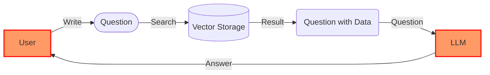

# 💻 Overview

## AI Service

Our company provides a data-driven chatbot SaaS. You can ask questions and receive answers using personal documents or other public data. You can use the chatbot in confidential mode using personal documents or provide the service through our own chatbot API. If you want to use it on-premises, we can support personal vector storage, embedding, and LLM technology.


<mark style="color:orange;">**Data-driven chatbot**</mark> uses <mark style="color:green;">**RAG**</mark> (Retrieval-Augmented Generation) and <mark style="color:green;">**TAG**</mark> (Tool-Augmented Generation) technologies.


A data-driven chatbot is similar to a QA chatbot that searches for data in documents or databases. Users can write blog posts with product information or customer response emails with customer history data. If you can manage prompts, you can create chatbot characters like foreign language teachers or astrologers.

## Web3 Service

We can provide services through our own chatbot API. We plan to provide various services using Web3 and generative AI technology. All of these are open source. Make your ideas a reality with Realbits.