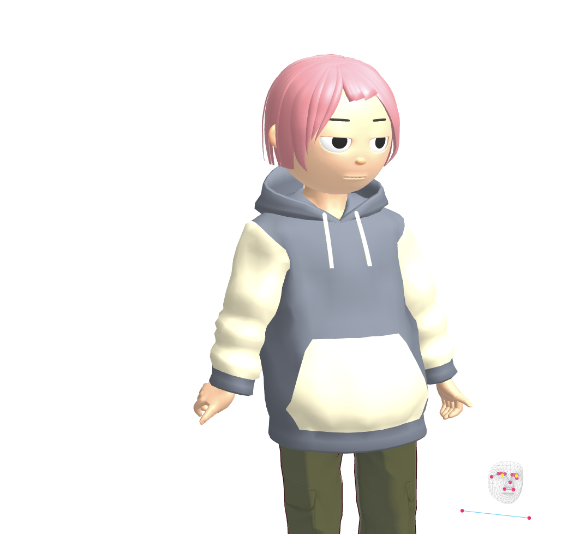
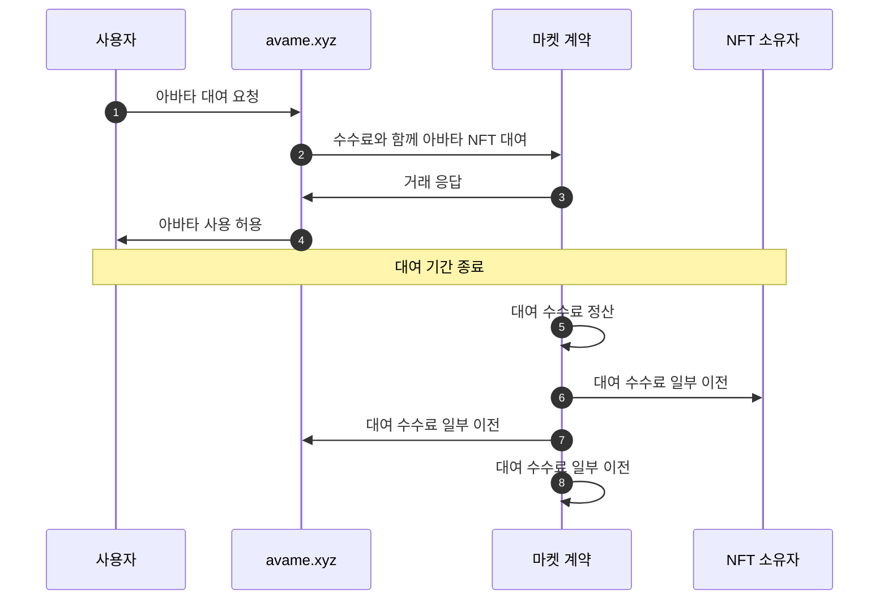

# 🏈 AvaMe

<figure><figcaption>
아바타 화면
</figcaption></figure>

* **설명**

사용자는 아바타 캐릭터를 선택하고 대화를 할 수 있습니다.

* **시퀀스 다이어그램**

* **사이트**
  * [https://test.avame.xyz](https://test.avame.xyz/)
* **GitHub**
  * [https://github.com/realbits-lab/avame](https://github.com/realbits-lab/avame)