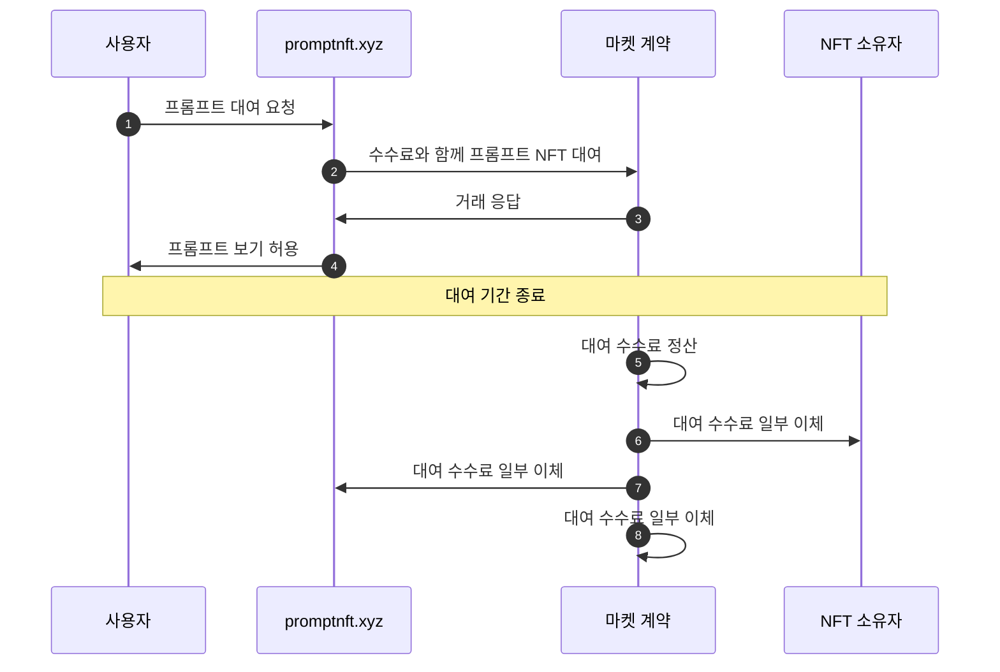

# 🖼 Fictures

## 설명

사용자는 생성적 AI 기술을 사용하여 프롬프트로 이미지를 그릴 수 있습니다. 사용자는 해당 이미지로 NFT를 발행할 수 있습니다.

사용자는 프롬프트 텍스트로 이미지를 생성하고 그릴 수 있습니다. 그런 다음, 원하는 경우 이미지를 암호화된 프롬프트 데이터와 함께 NFT로 게시할 수 있습니다.

NFT 발행 여부와 관계없이 사용자가 이미지를 게시하도록 선택하면 이미지가 서비스 사이트에 게시됩니다. NFT로 발행된 이미지는 사용자에게 프롬프트를 표시하지 않습니다.

사용자가 프롬프트를 보려는 경우 토큰을 지불하고 제한된 시간(아마도 하루) 동안 프롬프트를 볼 수 있습니다. 프롬프트 기간이 종료되면 프롬프트 수수료는 스마트 계약을 통해 NFT 소유자, 서비스 소유자 및 마켓 소유자와 공유됩니다.

<figure><figcaption>
이미지 NFT
</figcaption></figure>

## 서비스 시퀀스 다이어그램

## **사이트**

* [https://test.fictures.xyz](https://test.fictures.xyz/)

## **GitHub**

* [https://github.com/realbits-lab/prompt-nft](https://github.com/realbits-lab/prompt-nft)