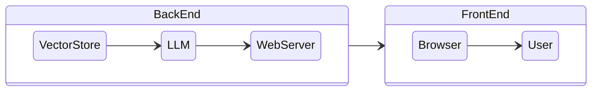
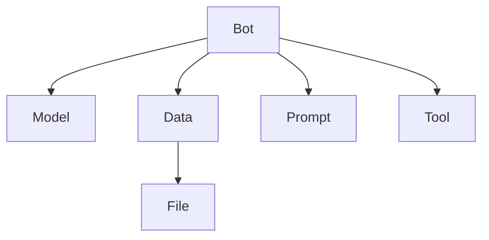

# 🦷 Thothy

## 아키텍처

Thothy SaaS에는 프론트엔드 웹 애플리케이션과 백엔드 서버 두 가지 구성 요소가 있습니다. 데스크톱 및 모바일 웹을 지원하는 웹 프론트엔드는 Chrome, Safari 및 Edge 브라우저를 지원합니다. 백엔드 서버는 웹 서버, 벡터 저장소 및 LLM 프레임워크로 구성됩니다. LLM에는 OpenAI API와 개인 LLM 두 가지 유형이 있습니다.

## 구성 요소

Thothy는 다섯 가지 구성 요소로 구성됩니다.

### Bot

**Bot에는 모델, 데이터, 프롬프트 및 도구가 포함되어 있습니다.** 사용자는 목록보기에서 이들을 선택할 수 있습니다. 예를 들어, 사용자는 개인 LLM 모델, 개인 데이터, 특정 프롬프트 및 이미지 생성 도구를 사용할 수 있습니다. 모델은 필수이지만 데이터, 프롬프트 및 도구는 선택 사항입니다. 챗봇의 경우 외국어 교사나 마케팅 작가가 될 수 있습니다.

### Model

**모델은 LLM (대형 언어 모델)입니다.** 공개 LLM은 OpenAI의 GPT-3.5 또는 GPT-4입니다. 그러나 상업적 라이선스로 사용할 수 있는 좋은 LLM도 있습니다. Realbits는 이러한 모델을 성능 미세 조정 모델로 사용하려고 합니다. 검색 프로세스를 위해 Realbits의 미세 조정 임베딩 모델을 사용합니다. 사용자는 GPT와 오픈 LLM 중에서 선택할 수 있습니다.

### Data

**데이터는 벡터 데이터베이스에서 검색됩니다.** 사용자가 데이터 파일을 서버에 업로드하면 서버는 해당 파일에서 임베딩 벡터를 추출하여 벡터 데이터베이스에 저장합니다. 사용자의 쿼리의 경우, 서버는 벡터 데이터베이스에서 유사성을 검색합니다. 다양한 파일 유형을 지원할 수 있습니다.

### Prompt

챗봇에는 두 가지 유형의 프롬프트가 있습니다. 하나는 시스템 유형이고 다른 하나는 사용자 유형입니다. 일반적으로 **시스템 프롬프트**는 전체 채팅을 관리할 수 있습니다. 사용자는 이 시스템 프롬프트를 사용하여 챗봇의 프로필과 응답 동작을 수정할 수 있습니다. **사용자 프롬프트**는 채팅 프롬프트입니다. 사용자는 이 사용자가 제공하는 프롬프트를 사용하여 쿼리를 할 수 있습니다.

### Tool

**도구는 다른 시스템과 작업을 수행하는 데 사용됩니다.** 챗봇은 웹 검색 API를 사용하여 웹 페이지를 검색할 수 있습니다. 예를 들어, 사용자가 웹 페이지 검색을 위해 웹 검색 기능을 사용하여 쿼리하는 경우입니다. 또는 이미지 생성 API를 사용하여 사용자는 LLM에게 이미지를 그리도록 요청할 수 있습니다.

## 기능

### 유연한 챗봇

사용자는 데이터, 프롬프트, 도구, 모델과 같은 챗봇의 속성을 변경할 수 있습니다. 사용자는 목록보기에서 각 구성 요소를 선택하고 DIY 챗봇에서 사용할 수 있습니다. 사용자는 예를 들어 두 가지 유형의 문서 데이터가 있는 경우 두 개의 챗봇을 사용할 수 있습니다. 각 챗봇은 다른 유형의 문서 정보에 대한 링크를 가지고 있습니다. 또한 사용자는 프롬프트를 처리하여 챗봇의 응답 동작을 제어할 수 있습니다. 사용자가 챗봇에게 교사나 상담사로서의 역할을 수행하도록 요청하면 챗봇은 그에 맞게 동작합니다.

### 좋은 매칭

Thothy에는 임베딩을 위한 두 가지 방법이 있습니다. 하나는 문서 데이터를 분할하기 위해 청킹을 사용하는 과정입니다. 다른 방법은 문서를 QA 유형의 텍스트로 변환하는 것입니다. 두 번째 과정에서는 QA 유형의 데이터를 기반으로 하기 때문에 유사성 검색이 더 정확합니다. 이 과정은 데이터 생성에 더 많은 리소스를 사용하지만, 고품질의 매칭 결과를 위해 그 노력이 가치가 있습니다.

### 빠른 응답

Thothy는 독자적인 임베딩 모델을 사용합니다. 사용자가 개인 LLM을 선택하는 경우 개인 LLM을 사용할 수도 있습니다. 이러한 유형의 모델은 성능에 적합합니다. 이렇게 함으로써 일반적인 LLM과 비교하여 응답 시간이 크게 줄어듭니다. SOTA 기술이 Thothy의 지속적인 개선 과정에 통합되어 있습니다.

### 제한된 비용

개인 LLM 사용 비용은 SaaS 구독 가격으로 제한됩니다. 대부분의 LLM 가격 모델은 사용 비용을 기반으로 하지만, Thothy는 다른 가격 모델을 제공합니다. 제한된 비용 모델은 사용자가 서비스 사용량을 모니터링할 필요를 없애줍니다.

### 서비스 API

사용자는 서비스의 API를 사용하여 챗봇을 외부 세계로 확장할 수 있습니다. 사용자가 챗봇에 대한 서비스 API를 설정하면 인증 키를 사용하여 해당 API에 액세스할 수 있습니다. 사용자는 이 기능을 사용하여 AI 아바타 서비스 또는 기타 재미있고 재밌는 서비스를 만들 수 있습니다.

## 가격 책정

가격 책정 모델에는 두 가지 유형이 있습니다. 기업용은 월 1,000달러의 구독료입니다. 온프레미스의 경우, <mark style="color:blue;">**ai.thothy@gmail.com**</mark>로 문의하십시오.

| 기능         | 기업용                | 온프레미스                  |
| ----------- | --------------------- | --------------------------- |
| 가격        | 월 1,000달러        | 문의 (구독 기반) |
| 데이터        | 500M                  | 무제한                   |
| 프롬프트      | 무제한             | 무제한                   |
| 도구        | 사용 가능             | 사용 가능                   |
| API         | 10,000 세션 당 1,000달러 | 10,000 세션 당 1,000달러       |
| 개인 LLM | 사용 가능             | 사용 가능                   |