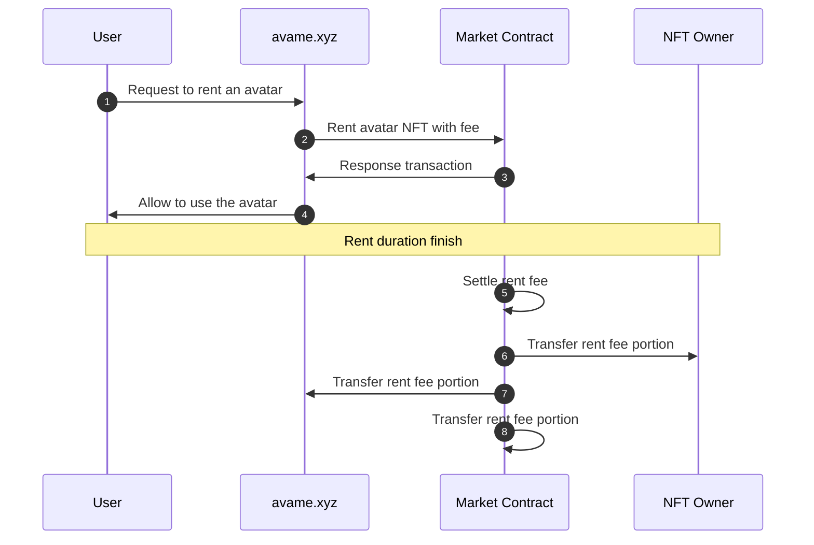

# 🙍♀ AvaMe

<figure><figcaption></figcaption></figure>

* **Description**

Users can select their avatars and express motion or face with the avatars in avame.xyz service.

* **Sequence Diagram**

* **Site**
  * [https://avame-development.vercel.app](https://avame-development.vercel.app/)
* **GitHub**
  * [https://github.com/realbits-lab/avame](https://github.com/realbits-lab/avame)
* **Dework**
  * [https://app.dework.xyz/realbits/avame](https://app.dework.xyz/realbits/avame)
* **Discord**
  * [#avame](https://discord.com/channels/1049501409755811940/1054219044703707196)

