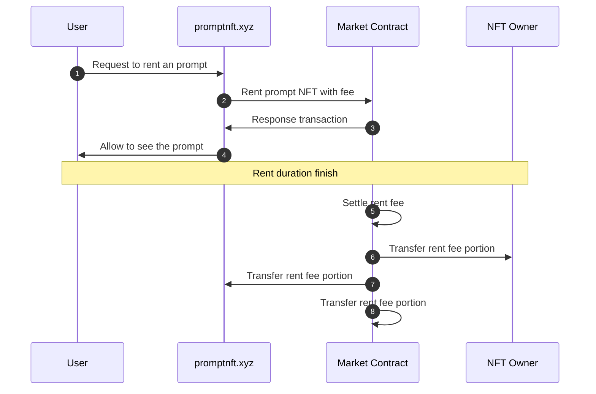

# 🖼 Fictures

<figure><figcaption></figcaption></figure>

* Description

User can draw image using /prompt command in discord channel with AI technology. AI model was learned with our content images. So the drawing image result is biased to our NFT content model. Discord chatbot service project is now under testing. When ready, it would be open in discord channel. And **user can mint NFT** with the result image.

promptnft.xyz is an online service for creating images with prompts and sharing those images with people. The user can generate and draw images with prompt text via the Discord chatbot. Then, if desired, the result can be produced as NFT with encrypted prompt data.

Whether minting is done or not, every image generated by the discord chatbot will be listed on the promptnft.xyz service site. A minting image would not display the prompt to the user.

When the user wants to see the prompt, he will have to pay a token and see the prompt for a limited time (perhaps one day). When prompt duration ends, prompt fee will be shared with NFT owner, promptnft.xyz service owner, and prompt market owner by smart contract.

* promptnft.xyz Service Sequence Diagram

* **Discord**
  * [#prompt](https://discord.com/channels/1049501409755811940/1049501409755811943)
