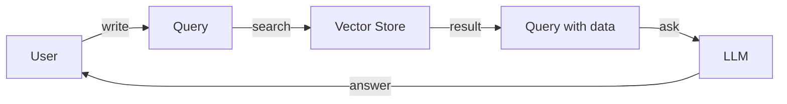

# 👨💻 Overview

## AI service

We provide data-driven chatbot SaaS. You can ask and get answer with your private document or other public data. You can use a chatbot with your own document in private mode, or provide a service with your own chatbot API. If you want to use in on-premise mode, we can support with private vector store, embedding, and LLM technology.


<mark style="color:orange;">**Data-driven chatbot**</mark> uses <mark style="color:green;">**RAG**</mark>(Retrieval-Augmented Generation) and <mark style="color:green;">**TAG**</mark>(Tool-Augmented Generation) technology.


Data-driven chatbot is kind of QA chatbot with data from documents or database. User can write blog article with product information or make a customer response email with customer history data. If you can manage prompt, you make a chatbot character like a foreign language teacher or astrologer.

## Web3 service

You can make a service with your own chatbot API. We will provide a few services with web3 and generative AI technology. And these are all open source. Build your idea with realbits solution.
