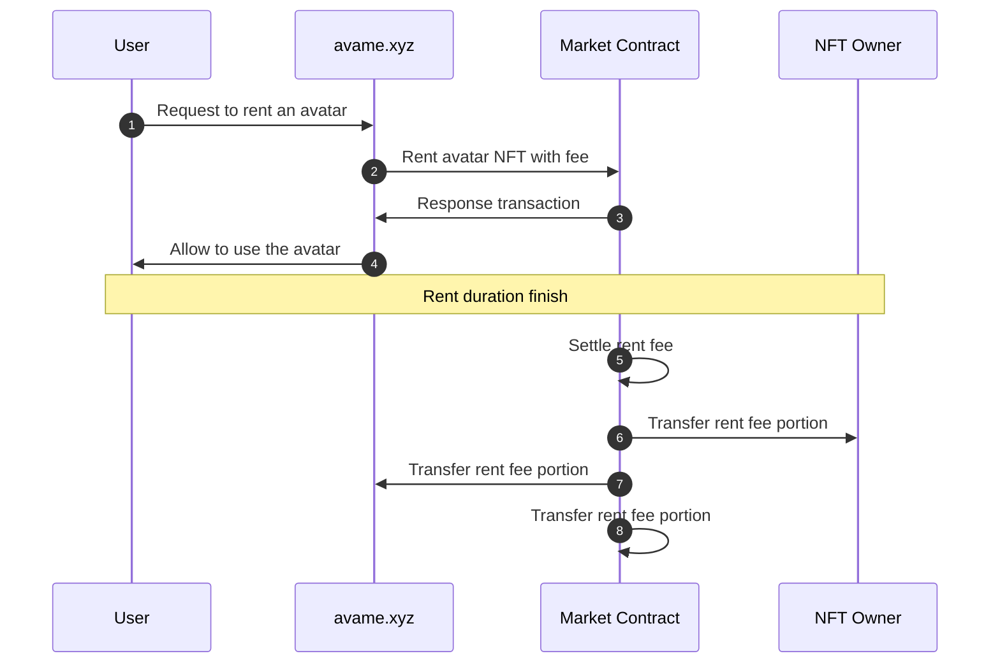

# 🙍♀ AvaMe

<figure><figcaption>
Avatar screen
</figcaption></figure>

* **Description**

Users can select avatar character and have a dialogue.

* **Sequence Diagram**

* **Site**
  * [https://test.avame.xyz](https://test.avame.xyz/)
* **GitHub**
  * [https://github.com/realbits-lab/avame](https://github.com/realbits-lab/avame)

